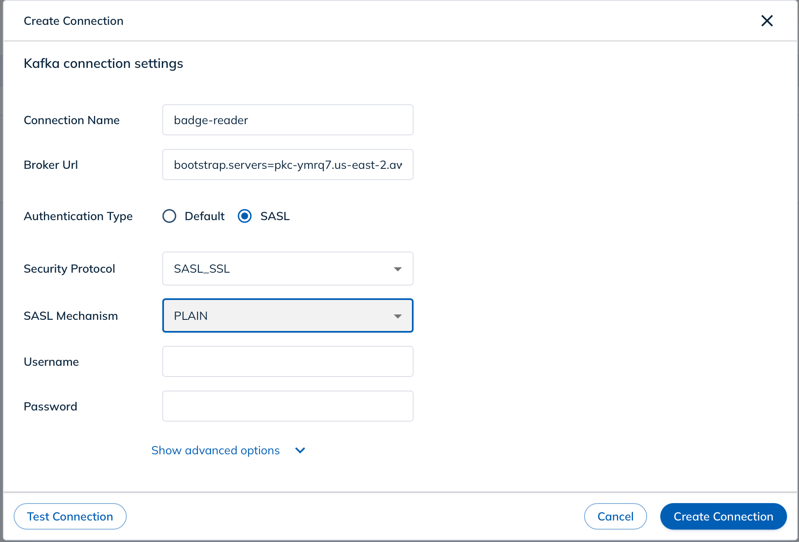
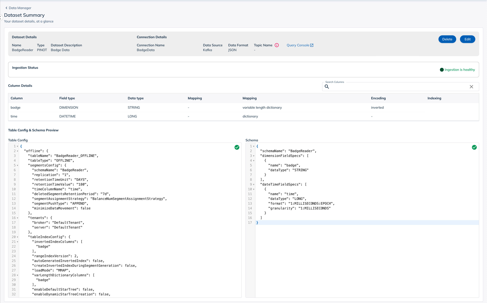

# Recording badge scans in Apache Pinot

## About Pinot

Apache Pinot(r) is a real-time distributed OLAP datastore. It is designed to provide fast aggregation of metrics with large data sets, and is optimized for fast ad-hoc queries. Pinot is a column-oriented datastore, and is optimized for aggregating metrics. It is designed to scale to trillions of rows and can ingest data in real-time.

## About this demo

In this post, I'll show you how I built a badge-scanner using smart-cards that records every badge-scan in Pinot. I'll also show you how to query the data in Pinot to get insights into badge-scans.

I also used Kafka as the messaging system to send badge-scan events to Pinot. I'll show you how to set up Kafka and Pinot on your local machine.

## Prerequisites

This is both a hardware and software exercise, so you will need a bit of kit to get this going. You will need:
1. A smart-card reader (I recommend the ACR122U because that's what I used in developing this demo)
2. Some smart-cards (I recommend the NXP NTAG215 because that's what I used in developing this demo)

Some knowledge of Go is also helpful, but not essential. All of the code for this is in the [badge-reader](https://github.com/davidgs/badge-reader) repository on GitHub.

## Setting up the hardware

The first thing you need to do is to set up the hardware. I'll show you how to set up the ACR122U smart-card reader and the NXP NTAG215 smart-cards.

### Setting up the ACR122U

The ACR122U is a USB smart-card reader. It's a pretty simple device to set up. You just need to plug it into your computer and install the drivers. You can find the drivers on the [ACR122U product page](https://www.acs.com.hk/en/products/3/acr122u-usb-nfc-reader/).

> Note: On macOS you just need to plug the thing in. No drivers needed. On Windows, you need to install the drivers. On Linux, you need to install the drivers and the libnfc library.

### Setting up the NXP NTAG215

There is literally no setup for this. It's just a card that has an NFC chip inside. It is inert until you place it on the reader.

## Setting up the software

The next thing you need to do is to set up the software. I'll show you how to set up the badge-reader and the Kafka and Pinot servers.

### Setting up the badge-reader

The badge-reader is a Go program that reads badge scans from the ACR122U and sends them to Kafka. It's a pretty simple program. It just reads the UID from the smart-card and sends it to Kafka. It runs in n infinite loop waiting for a card to be placed on the reader. When a card is placed on the reader, it reads the UID from the card and sends it to Kafka. It then waits for another card to be placed on the reader.

I created a data type for the card information:

```go
type Card struct {
	Badge string `json:"badge"`
	Time  int64 `json:"time"`
}
```

The `Badge` field is the UID of the card. The `Time` field is the time the card was scanned, in milliseconds since the epoch.

The `main` function is pretty short too:

```go
func main() {
	for {
		ctx, err := scard.EstablishContext()
		if err != nil {
			die(err)
		}
		defer ctx.Release()
		readers, err := ctx.ListReaders()
		if err != nil {
			die(err)
		}
		if len(readers) > 0 {
			index, err := waitUntilCardPresent(ctx, readers)
			if err != nil {
				die(err)
			}
			card, err := ctx.Connect(readers[index], scard.ShareExclusive, scard.ProtocolAny)
			if err != nil {
				die(err)
			}
			command := []byte{0xFF, 0xCA, 0x00, 0x00, 0x00}
			rsp, err := card.Transmit(command)
			if err != nil {
				die(err)
			}
			uidHex := hex.EncodeToString(rsp)
			fmt.Println("Card UID:", uidHex)
			newCard := Card{Badge: uidHex, Time: time.Now().UnixMilli()}
			message, err := json.Marshal(newCard)
			if err != nil {
				die(err)
			}
			fmt.Println("Message:", message)
			err = sendToKafka("badges", string(message))
			if err != nil {
				die(err)
			}
			for {
				_, err := waitUntilCardGone(ctx, readers)
				if err != nil {
					die(err)
				}
				card.Disconnect(scard.ResetCard)
				card = nil
				ctx.Release()
				ctx = nil
				break
			}
		}
	}
}
```

I run an infinite loop that connects to the ACR122U and waits for a card to be placed on the reader. When a card is placed on the reader, it reads the UID from the card and sends it to Kafka. It then waits for the card to be removed from the reader.

I put the logic for waiting for a card to be put on the reader and waiting for a card to be removed from the reader in separate functions to keep things as simple as possible. The `waitUntilCardPresent` function is pretty simple:

```go
func waitUntilCardPresent(ctx *scard.Context, readers []string) (int, error) {
	rs := make([]scard.ReaderState, len(readers))
	for i := range rs {
		rs[i].Reader = readers[i]
		rs[i].CurrentState = scard.StateUnaware
	}
	for {
		for i := range rs {
			if rs[i].EventState&scard.StatePresent != 0 {
				return i, nil
			}
			rs[i].CurrentState = rs[i].EventState
		}
		err := ctx.GetStatusChange(rs, -1)
		if err != nil {
			return -1, err
		}
	}
}
```

It's another infinite loop waiting for the card status to change. When the card status changes, it returns the index of the reader that the card was placed on. When a card is  placed on the reader, the status changes to `CardPresent`. When the card is removed from the reader the `CardPresent` status is replaced by a `0` status so the `waitforCardGone` function waits for the status to change to `0` before it returns.

Finally there is a `sendToKafka` function that sends a message to Kafka:

```go
func sendToKafka(topic string, message string) error {
	configFile := "./properties"
	conf := ReadConfig(configFile)

	p, err := kafka.NewProducer(&conf)
	if err != nil {
		return fmt.Errorf("error creating producer: %w", err)
	}
	p.Produce(&kafka.Message{
		TopicPartition: kafka.TopicPartition{
			Topic:     &topic,
			Partition: kafka.PartitionAny},
		Value: []byte(message),
	}, nil)
	go func() {
		for e := range p.Events() {
			switch ev := e.(type) {
			case *kafka.Message:
				if ev.TopicPartition.Error != nil {
					fmt.Printf("Failed to deliver message: %v\n", ev.TopicPartition)
				} else {
					fmt.Printf("Produced event to topic %s: key = %s value = %s\n",
						*ev.TopicPartition.Topic, string(ev.Key), string(ev.Value))
				}
			}
		}
	}()
	p.Flush(15 * 1000)
	p.Close()
	return nil
}
```

That's it. Wait for a card, read the UID, send the UID to Kafka, wait for the card to be removed, and then start over. This is the kind of card reader that you could use to check people into a conference or a party, or scan merchandise as it is stocked, or sold.

It's also possible to read more data from the card, if it is present, but for now I'm just reading the UID.

### Setting up the Kafka server

Ot make things easy for myself I used Confluent's Cloud service to set up a Kafka server. I created a free account and then created a new cluster. I then created a new topic called `badges` and set the retention period to 1 day. I also created a new API key and secret. I used the API key and secret to create a `properties` file that I used to connect to the Kafka server.

```properties
# Required connection configs for Kafka producer, consumer, and admin
bootstrap.servers=<your cloud server>:9092
security.protocol=SASL_SSL
sasl.mechanisms=PLAIN
sasl.username=<your api key>
sasl.password=<your api secret>

# Best practice for higher availability in librdkafka clients prior to 1.7
session.timeout.ms=45000
```

### Running the program

I ran the program on my Raspberry Pi and it worked great. I was able to scan my badge and see the message in the Kafka topic.

```bash
$ go run main.go
Card UID: 045e0f7fdf61809000
Message: [123 34 98 97 100 103 101 34 58 34 48 52 53 101 48 102 55 102 100 102 54 49 56 48 57 48 48 48 34 44 34 116 105 109 101 34 58 49 54 56 49 51 51 52 49 50 48 50 48 53 125]
Produced event to topic badges: value = {"badge":"045e0f7fdf61809000","time":1681334120205}
...
```

### Reading the messages from Kafka into StarTree Cloud

I created a new StarTree Cloud project and then went into Data Manager to create a new data source. I selected Kafka as the data source type and then entered the Kafka server information and the topic name.


Once you click New Connection you will be asked to enter your credentials for your Kafka server. I used the API key and secret that I created earlier and that is in my `properties` file referenced above.




The next screen will ask you to name your data-set and add a description, after which it will attempt to start retrieving data from Kafka.


 If everything is working correctly you should see data show up when you click the ‘Check Sample Data’ button.


As you can see, once I connected to my Kafka broker I can see a few badge numbers and timestamps that were already in the broker.
Finally you can click through to 'Create Dataset' and add your new dataset. You’ll then see the Pinot table config and schema displayed.



Once the data source is active you can go to the Data Explorer and start exploring your data.


So far there’s not much data in here, and it may not look entirely useful to have this, but if you follow this series of blog posts you will see how I can start to use this data, in conjunction with other data, to build something quite useful.


### Conclusion

I hope you enjoyed this post. I had a lot of fun building this project and I’m looking forward to building more projects with the ACR122U and StarTree Cloud. If you have any questions or comments, please leave them below.


If you want to learn more about StarTree Cloud, you can sign up for a free account at [https://www.startree.ai](https://www.startree.ai).

We'd love to have you join our [Slack Community](https://stree.ai/slack), follow us on [Twitter](https://twitter.com/startreedata) and [LinkedIn](https://www.linkedin.com/company/startreedata/).